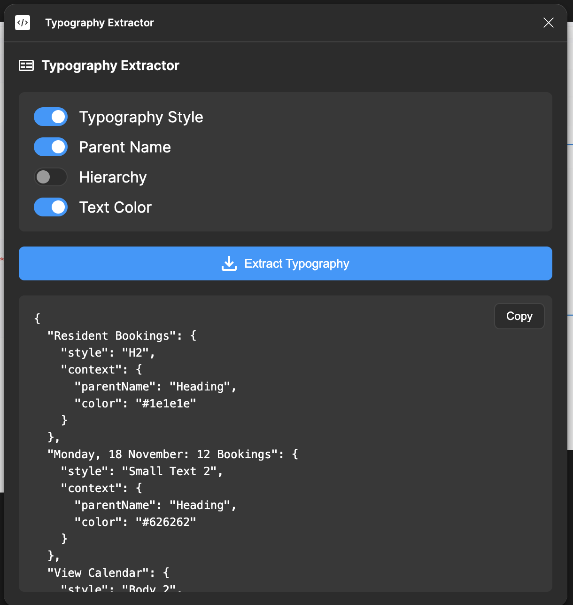

# Figma Typography Extractor

A Figma plugin that helps extract typography styles from your Figma designs.

## Features

- Extract typography styles from selected layers
- View and manage text styles in a convenient interface
- Easy-to-use UI for typography management

## Installation
1. Open Figma
2. Click on the plugin icon in the sidebar
3. Click on development in the sidebar
4. Click on install from manifest and select the manifest.json file


## Development

1. Clone this repository
```bash
git clone [repository-url]
cd figma-typography-extractor
```

2. Install dependencies
```bash
pnpm install
```

3. Build the plugin
```bash
pnpm build
```

## Project Structure

- `code.ts` - Main plugin code (TypeScript)
- `code.js` - Compiled JavaScript
- `ui.html` - Plugin UI
- `manifest.json` - Figma plugin manifest
- `tsconfig.json` - TypeScript configuration

## Requirements

- Node.js
- pnpm
- Figma Desktop app for testing

## Contributing

1. Fork the repository
2. Create your feature branch (`git checkout -b feature/amazing-feature`)
3. Commit your changes (`git commit -m 'Add some amazing feature'`)
4. Push to the branch (`git push origin feature/amazing-feature`)
5. Open a Pull Request

## License

This project is licensed under the MIT License - see the LICENSE file for details.


<!-- add screenshot.png -->

